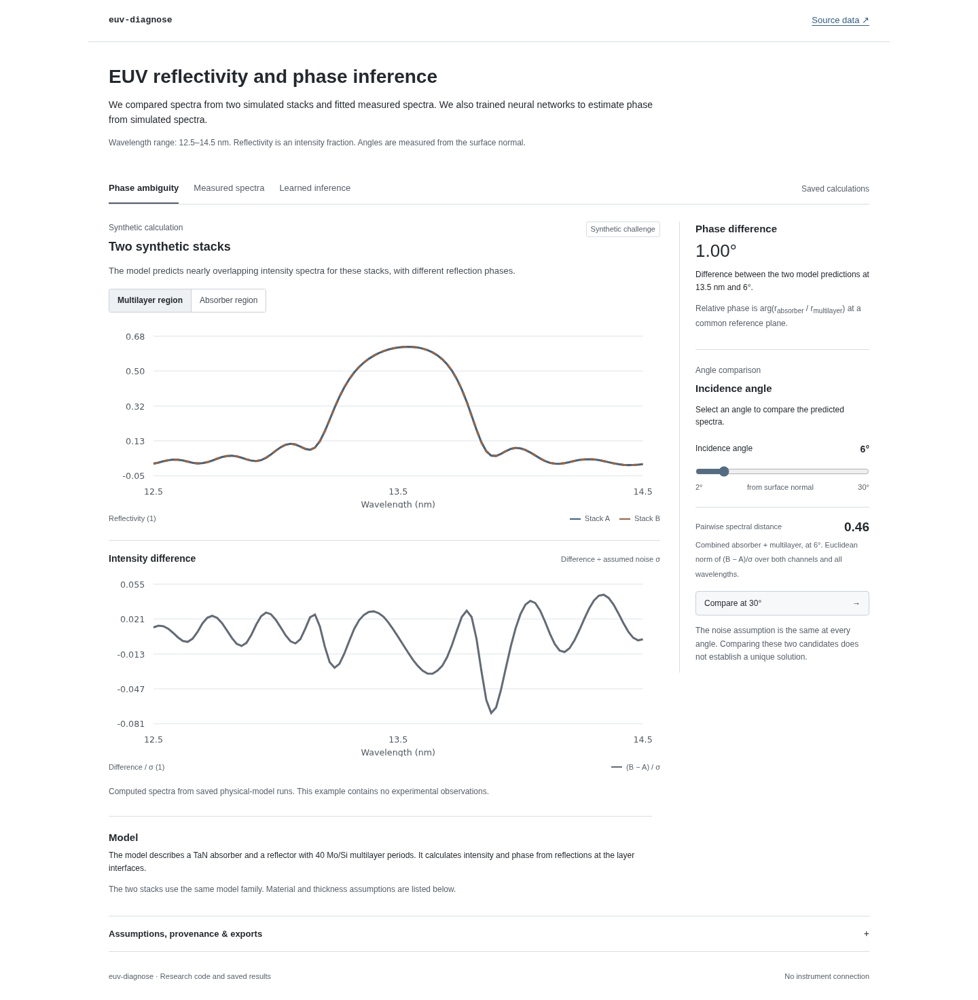

# EUV-Diagnose

EUV-Diagnose is a Python study of phase inference from reflectivity spectra. The code fits published measurements with a thin-film model and generates data for a neural estimator. A local web page shows the spectra, fit residuals, and test results.

The current code covers one TaN mask family. The target is the relative reflection phase of the absorber and exposed multilayer at 13.5 nm and 6° from normal. The measurements and original model come from [Stuart Sherwin's EUV repository](https://github.com/s-sherwin/EUV), accompanying [the EUV reflectometry study](https://doi.org/10.1117/1.JMM.20.3.031011).



## Run

Install [uv](https://docs.astral.sh/uv/), Python 3.12 or later, and Node.js 22. From this checkout:

```sh
make install
make demo
```

Open http://127.0.0.1:8000. The results and trained weights are included. After installing dependencies, the demo runs offline on CPU. The page exports data as CSV or JSON and figures as SVG. The Python commands require the checkout and its data files.

If port 8000 is in use, run `uv run euv-diagnose demo --port 4319` after building the app.

## Methods and results

The solver uses transfer-matrix optics. Tests compare its complex amplitudes with the original code and check analytic cases. One check found an inconsistent boundary in the original repeated-layer calculation. The corrected calculation agrees with an explicit expansion of all 40 periods. The original convention remains available for reproducing the saved upstream fits.

A numerical search found two synthetic stacks whose relative phases differ by 1.00° but whose intensity spectra are nearly identical across seven angles. The page compares their spectra at additional angles. The pair depends on the stated parameter bounds and noise assumptions. The pair does not define a phase uncertainty interval or establish which measurement is optimal.

The measured-data study fits 22 stack parameters to published absorber and multilayer spectra. A second fit also varies intensity gains and an angle offset. Its predicted phase is 153.58°, compared with 147.21° for the stack-only fit. Its holdout error is slightly higher. The holdout is exploratory: the saved initialization was fitted to all angles. No independent phase measurement is available to check either prediction. The [fit notes](docs/REFIT.md) describe the objective and calibration bounds.

The learning study trains five small multilayer perceptrons on 8,000 simulated spectra. Their mean prediction estimates phase. A separate calibration set determines the interval width. The tests compare the estimator with ridge regression and physical least squares, then change the material ranges and add correlated measurement error.

| Synthetic test | Result |
|---|---:|
| Neural phase RMSE, 500 nominal cases | 2.40° |
| Ridge phase RMSE, same cases | 5.22° |
| Coverage of nominal 90% intervals | 89.4% |
| Coverage with changed assumptions | 74.6% |
| Physical / neural RMSE, same 32-case subset | 1.78° / 2.56° |
| Physical median / neural mean time per case, local CPU | 4.93 s / 0.113 ms |

Physical fitting was more accurate on the matched subset. Neural predictions were faster. Simulation and training costs are reported separately. The interval coverage argument applies to test cases exchangeable with the synthetic calibration data. Coverage is not guaranteed for each case or for different measurement conditions. The [model card](docs/MODEL_CARD.md) lists the input grid, data splits, and full results.

## Status

The solver, measured fits, scalar neural estimator, and web page are implemented. A joint posterior over stack and calibration parameters remains planned. A method for choosing the next measurement also needs to be built and tested. Experimental phase accuracy and usefulness to an external user have not been established. The [research plan](BUILD_PLAN.md) contains the remaining work.

The current model requires a fixed measurement grid and covers one mask family. Industrial fault diagnosis and wafer imaging have not been tested.

## Reproduce and develop

The [reproduction guide](docs/REPRODUCTION.md) gives the commands for each study. The repository includes source checksums, numerical references, and model weights in NumPy format. See [CONTRIBUTING.md](CONTRIBUTING.md) for the development workflow and the [browser report](qa/browser-report.md) for the tested interactions.

```sh
make check           # lint, tests, and package/web builds
make browser-install # once per machine
make e2e             # Chromium desktop and mobile viewport tests
```

GitHub Actions runs these checks. The web page uses TypeScript and SVG. Simulation and fitting use Python.

Code and generated weights use the [MIT license](LICENSE). Upstream attribution is in [THIRD_PARTY_NOTICES.md](THIRD_PARTY_NOTICES.md). Citation metadata is in [CITATION.cff](CITATION.cff).
